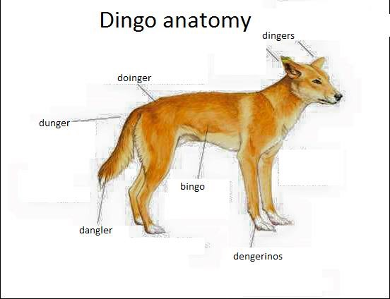

# Diners, Drive-Ins and Diverinos

Welcome to Guy Fieri's Gastronomic Chamber of Delights and Horrors.

# Instructions

1. Download or clone repo.
2. Set envs in `.env.example` and rename to `.env`
2. Make sure you have composer installed. (i.e. `brew install composer`)
3. `composer install`
4. `php -S localhost:8000` (or whatever port your little heart desires)
5. Eat your aforementioned heart out.
